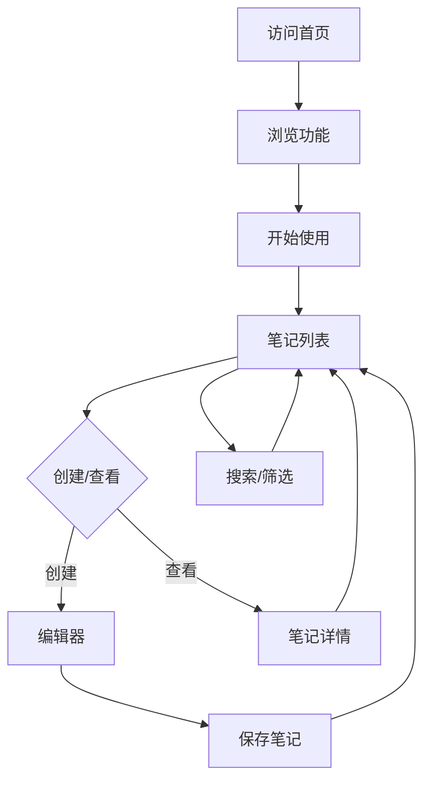

## 1. Product Overview

**项目名称**: NoteFlow - 创意笔记管理应用

NoteFlow 是一款简洁优雅的个人笔记管理工具，帮助用户高效记录、整理和管理日常笔记。支持富文本编辑、标签分类、搜索过滤等核心功能，界面设计现代简约，适合日常使用和工作学习场景。

**目标用户**: 学生、职场人士、自由创作者等需要记录和管理笔记的人群

**市场价值**: 提供轻量化的笔记解决方案，以简洁的界面和实用的功能提升用户的记录效率。

## 2. Core Features

### 2.1 User Roles
| Role | Registration Method | Core Permissions |
|------|---------------------|------------------|
| Normal User | Email registration/login | Create, read, update, delete notes |

### 2.2 Feature Module
1. **Home Page**: Hero section, navigation, featured notes
2. **Notes List**: All notes, search, filter by tags
3. **Note Editor**: Rich text editing, tag management
4. **Contact Form**: User feedback collection

### 2.3 Page Details
| Page Name | Module Name | Feature description |
|-----------|-------------|---------------------|
| Home Page | Hero section | Animated hero banner with call-to-action |
| Home Page | Features | Three core features showcase with icons |
| Notes List | Search | Real-time search filtering |
| Notes List | Tags | Tag-based filtering |
| Note Editor | Editor | Rich text content editing |
| Note Editor | Tags | Add/remove tags to notes |
| Contact | Form | User feedback submission |

## 3. Core Process

**用户流程**: 
1. 用户访问首页 → 浏览功能介绍
2. 用户点击"开始使用" → 进入笔记列表页
3. 用户创建新笔记 → 进入编辑器 → 保存笔记
4. 用户搜索/筛选笔记 → 查看匹配结果
5. 用户提交反馈 → 表单验证 → 提交成功

## 4. User Interface Design

### 4.1 Design Style
- **主色调**: 深蓝色 (#1e3a8a) + 薄荷绿 (#10b981)
- **按钮风格**: 圆角矩形，渐变色填充，悬停有缩放效果
- **字体**: Inter (现代无衬线字体)
- **布局风格**: 卡片式布局，清晰的视觉层次
- **图标**: Lucide React 图标库

### 4.2 Page Design Overview

| Page Name | Module Name | UI Elements |
|-----------|-------------|-------------|
| Home Page | Hero | Large headline, subtitle, CTA button, background gradient |
| Home Page | Features | Three feature cards with icons, titles, descriptions |
| Notes List | Header | Search input, tag filter chips |
| Notes List | Cards | Note preview cards with title, excerpt, tags |
| Note Editor | Toolbar | Bold, italic, list, heading buttons |
| Note Editor | Form | Title input, content textarea, tag selector |
| Contact | Form | Name, email, message inputs, submit button |

### 4.3 Responsiveness
- **桌面端**: 1200px+，完整功能展示
- **平板端**: 768px-1199px，自适应布局
- **移动端**: <768px，汉堡菜单，单列布局

### 4.4 3D Scene Guidance
- 不适用本项目
