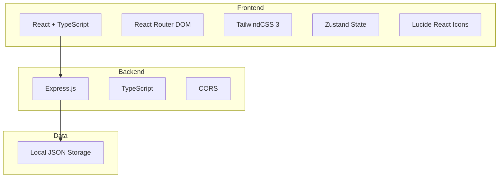
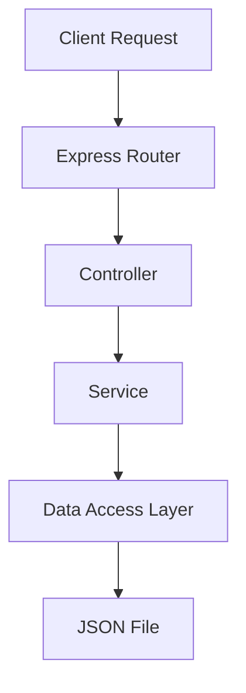
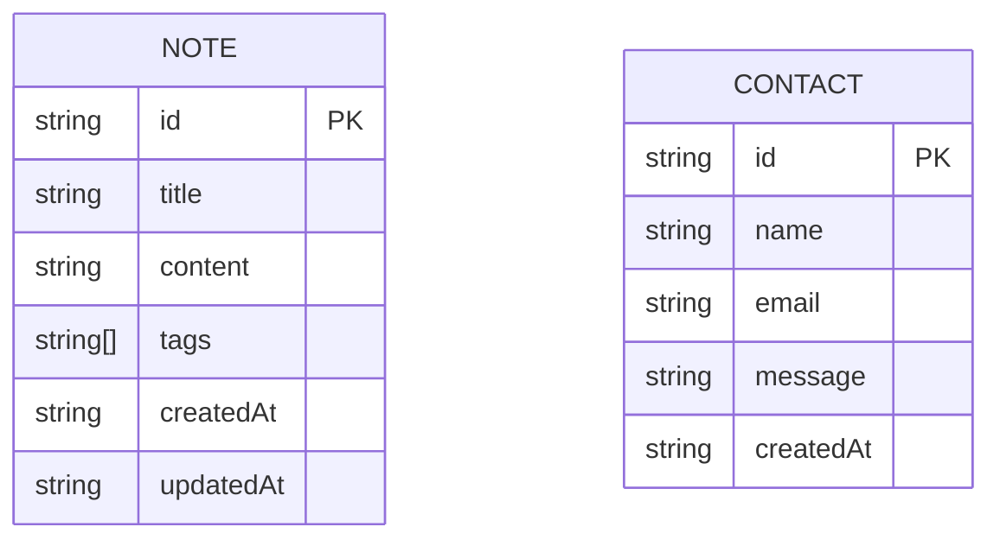

## 1. Architecture Design



## 2. Technology Description

- **Frontend**: React@18 + TypeScript + TailwindCSS@3 + Vite
- **Routing**: React Router DOM
- **State Management**: Zustand
- **Icons**: Lucide React
- **Backend**: Express.js + TypeScript
- **Initialization Tool**: vite-init (react-express-ts template)
- **Data Storage**: Local JSON file (for simplicity in demo)

## 3. Route Definitions

| Route | Purpose |
|-------|---------|
| / | Home page with hero and features |
| /notes | Notes list page with search and filter |
| /notes/new | Create new note page |
| /notes/:id | Edit existing note page |
| /contact | Contact form page |

## 4. API Definitions

### 4.1 Notes API

| Method | Endpoint | Description | Request Body | Response |
|--------|----------|-------------|--------------|----------|
| GET | /api/notes | Get all notes | - | `{ notes: Note[] }` |
| GET | /api/notes/:id | Get single note | - | `{ note: Note }` |
| POST | /api/notes | Create new note | `{ title, content, tags }` | `{ note: Note }` |
| PUT | /api/notes/:id | Update note | `{ title, content, tags }` | `{ note: Note }` |
| DELETE | /api/notes/:id | Delete note | - | `{ success: boolean }` |

### 4.2 Contact API

| Method | Endpoint | Description | Request Body | Response |
|--------|----------|-------------|--------------|----------|
| POST | /api/contact | Submit feedback | `{ name, email, message }` | `{ success: boolean, message: string }` |

### 4.3 Type Definitions

```typescript
interface Note {
  id: string;
  title: string;
  content: string;
  tags: string[];
  createdAt: string;
  updatedAt: string;
}

interface ContactForm {
  name: string;
  email: string;
  message: string;
}
```

## 5. Server Architecture Diagram



## 6. Data Model

### 6.1 Data Model Definition



### 6.2 Data Definition Language

由于使用本地 JSON 文件存储，无需 SQL DDL。初始数据结构如下：

```json
{
  "notes": [
    {
      "id": "1",
      "title": "欢迎使用 NoteFlow",
      "content": "这是你的第一条笔记，开始记录你的想法吧！",
      "tags": ["欢迎", "入门"],
      "createdAt": "2024-01-01T00:00:00Z",
      "updatedAt": "2024-01-01T00:00:00Z"
    }
  ],
  "contacts": []
}
```
